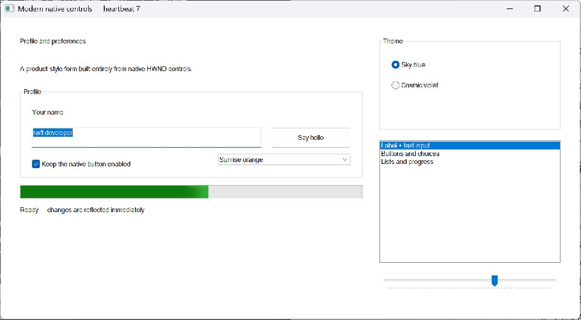
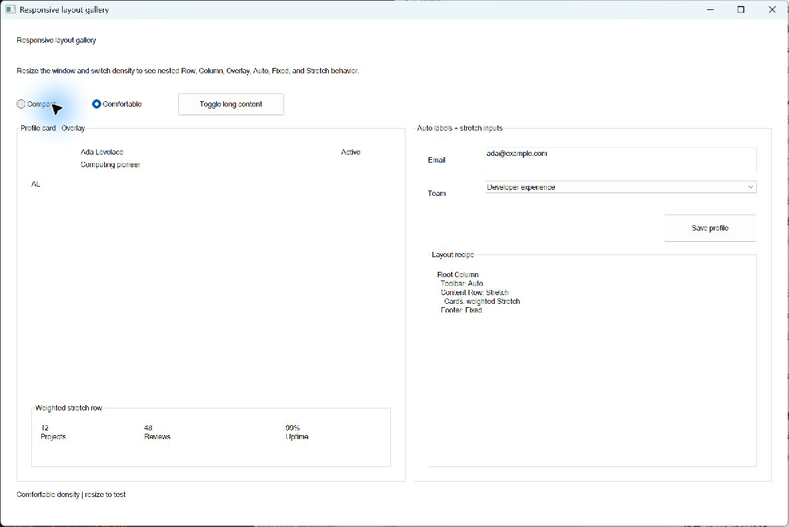

<p align="center">
  
</p>

<h1 align="center">mwtl</h1>

<p align="center"><strong>Modern Windows Thin Layer</strong></p>

<p align="center">Native Windows UI, without the Win32 ceremony.</p>

<p align="center">
  Build real HWND applications with typed C++20 events, responsive DPI-aware
  layout, explicit ownership, and an escape hatch to Win32 at every layer.
</p>

<p align="center">
  <a href="https://github.com/everettjf/mwtl/actions/workflows/ci.yml"></a>
  <a href="LICENSE"></a>
  
  
</p>

<p align="center">
  <a href="#quick-start">Quick start</a> &middot;
  <a href="#installation">Installation</a> &middot;
  <a href="#examples">Examples</a> &middot;
  <a href="https://everettjf.github.io/mwtl/components/">Components</a> &middot;
  <a href="https://everettjf.github.io/mwtl/">Documentation</a>
</p>

mwtl, the Modern Windows Thin Layer, wraps real HWND controls with clear
ownership, typed events, checked setup helpers, and DPI-aware responsive layout. It reduces Win32 ceremony without
hiding native handles, messages, styles, or return values.

<p align="center">
  <a href="examples/controls/main.cpp"></a>
  <a href="examples/common_controls/main.cpp"></a>
</p>

## Why mwtl

| Native by design | Modern where it matters | Small and transparent | Ready for real desktop work |
|---|---|---|---|
| Real HWND controls, Win32 messages, styles, handles, and return values remain available. | Typed events, RAII resources, C++20 ranges, checked setup, and responsive layout remove repetitive plumbing. | No custom renderer, virtual DOM, code generator, reflection system, or message-map macros. | Per-Monitor V2 DPI, ARM64, accessibility helpers, shell integration, worker wakeups, and wait-aware pumping. |

Use mwtl when you want Windows to look and behave like Windows, while keeping
application code readable enough to reason about.

## Quick start

```cpp
#include <mwtl/mwtl.h>

using mwtl::operator""_dip;

class MainWindow final : public mwtl::WindowBase {
public:
    void BuildUI() override {
        SetTitle(L"Hello, mwtl");

        mwtl::ControlHost ui{*this};
        ui.Add(message_, L"A native Windows UI with modern C++20 ergonomics.");
        ui.Add(close_, L"Close");

        SetLayout(
            mwtl::Column()
                .Margin(24_dip)
                .Gap(12_dip)
                .Add(message_, mwtl::Auto())
                .Add(close_, mwtl::Fixed(36_dip)));
    }

    mwtl::EventResult OnCommand(
        const mwtl::CommandEvent& event) override {
        if (event.IsClicked(close_)) {
            Close();
            return mwtl::EventResult::Handled();
        }
        return mwtl::EventResult::Propagate();
    }

private:
    mwtl::Label message_;
    mwtl::Button close_;
};

int WINAPI wWinMain(
    HINSTANCE instance, HINSTANCE, PWSTR, int show_command) {
    return mwtl::RunApplication<MainWindow>(instance, show_command);
}
```

That is a complete native application. `ControlHost` allocates control IDs,
`SetLayout` rearranges the real child windows on resize, and the window
overrides only the events it needs. The underlying HWNDs remain available for
anything outside the wrapper surface.

## Installation

The recommended integration is CMake `FetchContent`:

```cmake
cmake_minimum_required(VERSION 3.21)
project(my_app LANGUAGES CXX)

include(FetchContent)
FetchContent_Declare(mwtl
  GIT_REPOSITORY https://github.com/everettjf/mwtl.git
  GIT_TAG main
  GIT_SHALLOW TRUE)
FetchContent_MakeAvailable(mwtl)

add_executable(my_app WIN32 main.cpp)
target_link_libraries(my_app PRIVATE mwtl::mwtl)
```

Pin a release tag or immutable commit for reproducible application builds.

```powershell
cmake -S . -B build -G "Visual Studio 18 2026" -A x64
cmake --build build --config Debug
```

Use `Visual Studio 17 2022` with Visual Studio 2022. The complete
[setup guide](https://everettjf.github.io/mwtl/building.html) also covers an
installed `find_package` package, the Visual Studio folder workflow, VS Code,
offline WTL/WIL sources, and building this repository.

## What is included

- application and message-loop lifetime management;
- `WindowBase` with typed keyboard, mouse, resize, timer, DPI, command,
  notification, paint, and native-message events;
- 27 native child-control wrappers;
- automatic control IDs and source-located checked operations;
- C++20 range-based batch population;
- DPI-aware row, column, and overlay layout;
- menus, accelerators, modern file/folder dialogs, clipboard, shell drops,
  window placement, custom modal/modeless dialogs, task dialogs, image lists,
  tooltips, and RAII notification-area icons;
- wait-aware message pumping and lifetime-safe worker wakeups.
- optional, isolated Direct2D, Direct3D, WIC imaging, pinned Scintilla, and
  pinned WebView2 components with reference applications and offline self-tests.

Optional components are requested explicitly. For example, configure with
`MWTL_BUILD_WEBVIEW2=ON` and link `mwtl::webview2`, or configure with
`MWTL_BUILD_SCINTILLA=ON`, link `mwtl::scintilla`, and call
`mwtl_deploy_scintilla(your_target)`. Core-only consumers do not fetch, link,
or deploy either dependency.

The [component reference](https://everettjf.github.io/mwtl/components/) shows
every control with current code, a native screenshot, and its runnable example.
Detailed API notes live in [docs/api.md](docs/api.md).

## Examples

The repository contains 39 independently buildable programs. Each link opens
the complete source. Start with **Hello** for the smallest application,
**Controls** for the basic widget set, or **Hot corners** for a complete
multi-monitor utility.

<details>
<summary><strong>Browse all 39 runnable examples</strong></summary>

<br>

| Example | Source | Focus |
|---|---|---|
| Hello | [examples/hello/main.cpp](examples/hello/main.cpp) | Smallest complete native application |
| Application | [examples/application/main.cpp](examples/application/main.cpp) | Startup, message loop, and exit lifecycle |
| Window | [examples/window/main.cpp](examples/window/main.cpp) | HWND access, typed events, and native messages |
| Native message | [examples/native_message/main.cpp](examples/native_message/main.cpp) | Application-defined `WM_APP` messages |
| Keyboard | [examples/keyboard/main.cpp](examples/keyboard/main.cpp) | Typed key input |
| Mouse | [examples/mouse/main.cpp](examples/mouse/main.cpp) | Client coordinates and clicks |
| Resize | [examples/resize/main.cpp](examples/resize/main.cpp) | Client size and window state |
| Timer | [examples/timer/main.cpp](examples/timer/main.cpp) | RAII timers with `std::chrono` |
| Paint | [examples/paint/main.cpp](examples/paint/main.cpp) | Native GDI drawing |
| Minimum size | [examples/minmax/main.cpp](examples/minmax/main.cpp) | `WM_GETMINMAXINFO` |
| Close policy | [examples/close_policy/main.cpp](examples/close_policy/main.cpp) | Typed close interception |
| Window state | [examples/window_state/main.cpp](examples/window_state/main.cpp) | Restore, minimize, and maximize |
| DPI | [examples/dpi/main.cpp](examples/dpi/main.cpp) | Per-monitor DPI behavior |
| Window options | [examples/window_options/main.cpp](examples/window_options/main.cpp) | Styles, resources, and DIP bounds |
| Wait-aware pump | [examples/wait_aware/main.cpp](examples/wait_aware/main.cpp) | Handles and efficient idle work |
| Wakeup | [examples/wakeup/main.cpp](examples/wakeup/main.cpp) | Safe worker-to-window notification |
| COM STA | [examples/com_sta/main.cpp](examples/com_sta/main.cpp) | COM apartment lifecycle |
| Controls | [examples/controls/main.cpp](examples/controls/main.cpp) | Complete form-control gallery |
| Common Controls | [examples/common_controls/main.cpp](examples/common_controls/main.cpp) | Complete specialized-control gallery |
| Self-drawn host | [examples/self_drawn_host/main.cpp](examples/self_drawn_host/main.cpp) | Worker-driven native drawing |
| System lifecycle | [examples/system_lifecycle/main.cpp](examples/system_lifecycle/main.cpp) | Power, display, IME, and session messages |
| Hot corners | [examples/hot_corners/main.cpp](examples/hot_corners/main.cpp) | Complete multi-monitor utility |
| Form binding | [examples/form_binding/main.cpp](examples/form_binding/main.cpp) | Live model binding, validation, and explicit push/pull flow |
| Commands | [examples/commands/main.cpp](examples/commands/main.cpp) | One command model shared by menu, toolbar, and accelerators |
| Desktop integration | [examples/desktop_integration/main.cpp](examples/desktop_integration/main.cpp) | Modern dialogs, clipboard, drag-drop, and window placement |
| Document state | [examples/document_state/main.cpp](examples/document_state/main.cpp) | Dirty-state transitions and close decisions |
| Notepad | [examples/notepad/main.cpp](examples/notepad/main.cpp) | Complete Unicode SDI editor with safe file operations |
| Document workspace | [examples/document_workspace/main.cpp](examples/document_workspace/main.cpp) | Multi-window documents, active command routing, transfer rollback, and session restore |
| Appearance | [examples/appearance/main.cpp](examples/appearance/main.cpp) | Color modes, DWM backdrops, corners, and accessibility |
| Layout gallery | [examples/layout_gallery/main.cpp](examples/layout_gallery/main.cpp) | Responsive nested row, column, overlay, and sizing recipes |
| Settings | [examples/property_sheet/main.cpp](examples/property_sheet/main.cpp) | Persistent property pages with validation and Apply/OK/Cancel |
| Explorer | [examples/explorer/main.cpp](examples/explorer/main.cpp) | Rebar, commands, stable navigation, virtual data, tabs, and splitter |
| Drawing | [examples/drawing/main.cpp](examples/drawing/main.cpp) | Optional Direct2D host, DPI-aware input, device recovery, and SVG export |
| Image Viewer | [examples/image_viewer/main.cpp](examples/image_viewer/main.cpp) | WIC decode, color metadata, Fit/zoom/pan, and recoverable D2D pixels |
| Code Editor | [examples/code_editor/main.cpp](examples/code_editor/main.cpp) | Optional pinned Scintilla, Unicode files, search/replace, and notifications |
| Browser | [examples/browser/main.cpp](examples/browser/main.cpp) | Optional pinned WebView2, offline startup, process recovery, and navigation |
| Docking Workspace | [examples/docking_workspace/main.cpp](examples/docking_workspace/main.cpp) | IDE-style documents and tools with docking, floating, auto-hide, keyboard operation, and layout restore |
| Printing | [examples/printing/main.cpp](examples/printing/main.cpp) | Shared pagination, preview, printer settings, and balanced native print jobs |
| OLE drag/drop | [examples/ole_drag_drop/main.cpp](examples/ole_drag_drop/main.cpp) | Unicode, files, and custom formats through native OLE drag/drop |
| Shell integration | [examples/shell_integration/main.cpp](examples/shell_integration/main.cpp) | Associations, Jump Lists, taskbar state, and versioned settings |

</details>

<p align="center">
  <a href="examples/form_binding/main.cpp"></a>
  <a href="examples/layout_gallery/main.cpp"></a>
</p>

The [examples catalog](examples/README.md) lists every target and its run
commands. The [website](https://everettjf.github.io/mwtl/) highlights selected
content-rich examples with screenshots and source links.

## Build this repository

Requirements: Windows 10 1809 or newer, x64 or ARM64, Visual Studio 2022 or newer with
MSVC, a Windows SDK and C++ ATL, CMake 3.21 or newer, and C++20.

```powershell
cmake --preset vs2026-x64
cmake --build --preset vs2026-x64-debug
ctest --preset vs2026-x64-debug
```

Visual Studio 2022 is also supported: replace `vs2026` with `vs2022` in
the configure, build, and test preset names. Visual Studio 2026 is recommended.

On an ARM64 development machine use `vs2026-arm64` and
`vs2026-arm64-debug` (or the corresponding VS 2022 presets).

Build and test Release:

```powershell
cmake --build --preset vs2026-x64-release
ctest --preset vs2026-x64-release
```

For repository development, `./scripts/doctor.ps1` discovers the supported
toolchains and `./scripts/verify.ps1 -Mode Fast` runs the standard edit loop.

The project rejects non-Windows, non-MSVC-compatible ABI, and 32-bit
configurations. CI validates MSVC x64 and ARM64, clang-cl (with its GUI-launch
self-test covered by the MSVC matrices due to a hosted-runner activation issue), AddressSanitizer,
Debug/Release, public-header independence, package consumption, manifests,
examples, resource lifetime, API surface, deterministic property cases, and a
74% native source-coverage floor with an archived Cobertura report.

## Dependencies

CMake fetches pinned official WTL and Microsoft WIL revisions. Exact sources
and licenses are recorded in [THIRD_PARTY_NOTICES.md](THIRD_PARTY_NOTICES.md).
For controlled environments, see the
[offline setup instructions](https://everettjf.github.io/mwtl/building.html#offline).

## Documentation

- [Win32++ capability parity roadmap](docs/win32xx-parity-roadmap.md)
- [IDE-style docking workspace tutorial](docs/tutorials/docking-workspace.md)

- [Using mwtl with coding agents](docs/agent-usage.md)
- [Copyable application templates](templates/)
- [Task recipes](docs/recipes/)
- [Agent-oriented public API contracts](docs/agent-reference.md)
- [Machine-readable task-to-API index](docs/api-index.json)
- [Capability and scope map](docs/scope-map.md)
- [Coding-agent evaluation suite](agent-evals/)
- [Compact agent context](docs/llms.txt)
- [Get started](https://everettjf.github.io/mwtl/building.html)
- [Component reference](https://everettjf.github.io/mwtl/components/)
- [Current API notes](docs/api.md)
- [Public header reference](docs/reference.md)
- [Design and scope](docs/design.md)
- [API stability](docs/stability.md)
- [Accessibility and keyboard checklist](docs/accessibility.md)
- [System-message recipes](docs/system-message-recipes.md)
- [Contributing](CONTRIBUTING.md)

## License

[MIT](LICENSE). WTL, WIL, and other third-party dependencies retain their own
licenses.
