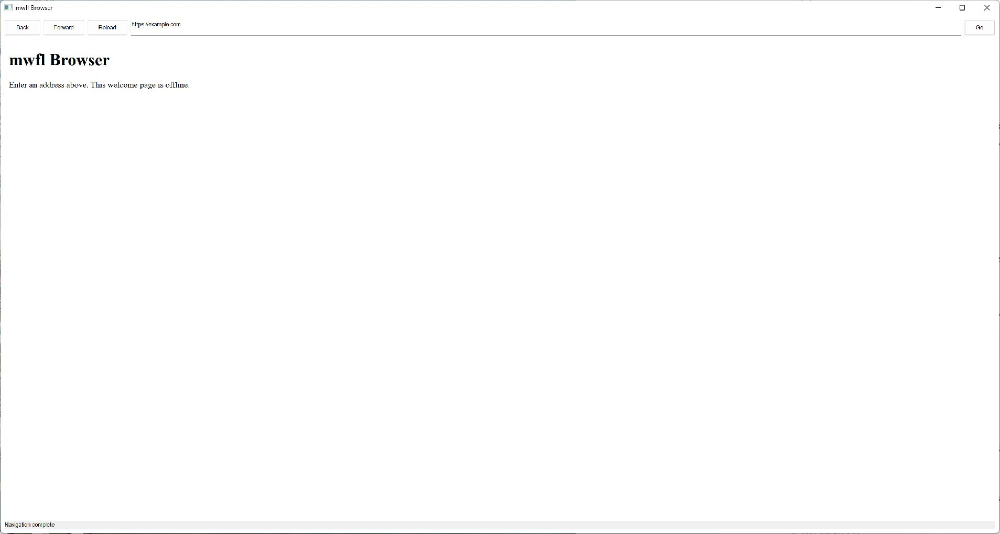

# Browser

This compiled example demonstrates **optional pinned WebView2 browser with structured runtime availability asynchronous lifecycle offline navigation and process recovery**. It is intentionally small
enough to study from the source while still using real native Windows controls,
messages, and ownership rules.



## What it demonstrates

- `WebView2Host`
- `WebView2InitializationResult`
- `WebView2ProcessFailureKind`

The window remains a real HWND and the example preserves mwfl's native escape
hatch. UI objects stay on their creating thread, and no exception is allowed to
cross a Win32 callback.

## Key code

The following excerpt is quoted directly from [`main.cpp`](main.cpp):

```cpp
class BrowserWindow final : public mwfl::WindowBase {
public:
    void BuildUI() override {
        SetTitle(L"mwfl Browser");
        mwfl::ControlHost ui{*this};
        ui.Add(back_, kBack, L"Back");
        ui.Add(forward_, kForward, L"Forward");
        ui.Add(reload_, kReload, L"Reload");
        ui.Add(address_, kAddress, L"https://example.com");
        ui.Add(go_, kGo, L"Go");
        ui.AddNative(browser_, kBrowser, mwfl::RectDip{});
        ui.Add(status_, L"Starting WebView2...");

        mwfl::Must(mwfl::SetAccessibleName(address_.GetHwnd(), L"Web address"),
                   "name browser address field");
        mwfl::Must(mwfl::SetAccessibleName(browser_.GetHwnd(), L"Web page"),
                   "name browser content");
        mwfl::Must(mwfl::SetAccessibleName(status_.GetHwnd(), L"Browser status"),
```

Read the complete implementation in [`main.cpp`](main.cpp).

## Build and run

From a Visual Studio developer PowerShell at the repository root:

```powershell
cmake --preset vs2026-x64-optional
cmake --build --preset vs2026-x64-optional-debug --target mwfl_browser_demo
build\presets\vs2026-x64-optional\examples\browser\Debug\mwfl_browser_demo.exe
```

Visual Studio 2022 remains supported; substitute the `vs2022-x64` configure and
build presets when validating that toolchain. This example uses the optional `webview2` component; the optional preset shown above enables its pinned dependency and runtime staging rules.

## Validation

The focused validation targets are `mwfl.webview2_model`, `mwfl.webview2_native`, `mwfl.browser_gui`. Run `./scripts/verify-change.ps1 -Execute` after modifying it so
the repository selects the additional checks required by the changed paths.
