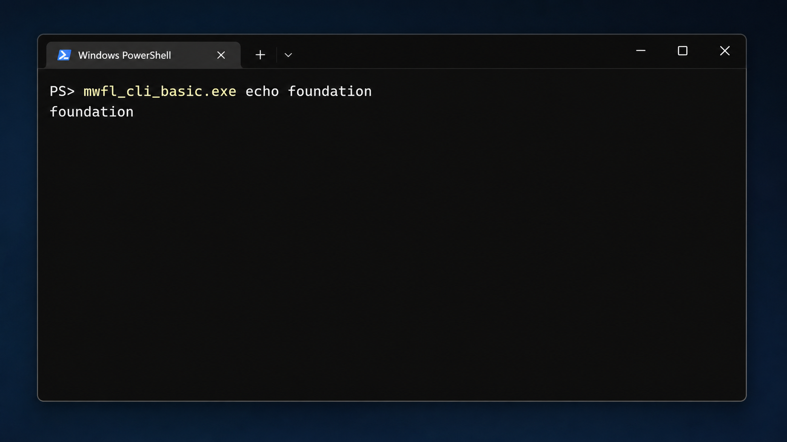

# CLI basic

This compiled console example demonstrates a Unicode `wmain` boundary, small
command routing, stdout/stderr separation, and stable exit codes without
creating an HWND or linking `mwfl::ui`.



## Key code

The command boundary stays small and returns a documented usage error:

```cpp
int wmain(int argc, wchar_t** argv) {
    return Run({argv + 1, static_cast<std::size_t>(argc - 1)});
}
```

Read the complete implementation in [`main.cpp`](main.cpp).

## Build and run

```powershell
cmake --build --preset vs2026-x64-debug --target mwfl_cli_basic
build\presets\vs2026-x64\examples\cli_basic\Debug\mwfl_cli_basic.exe echo foundation
```

Run `ctest --preset vs2026-x64-debug -R mwfl.cli_basic` to exercise its help
and success paths.
