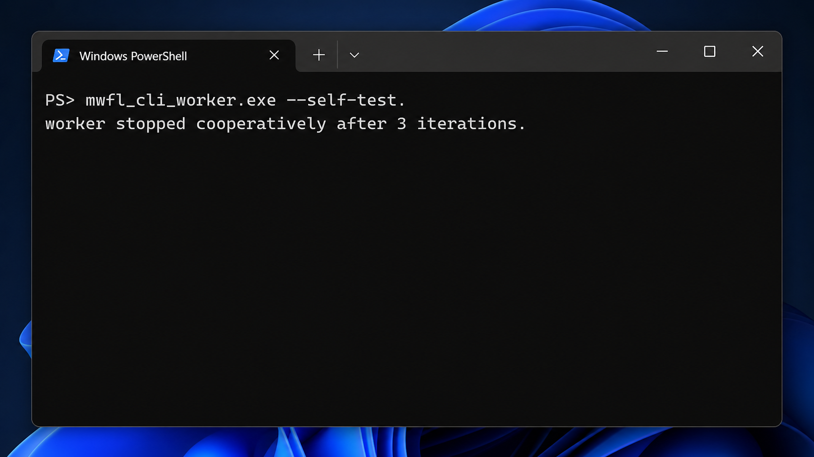

# CLI worker

This compiled console example demonstrates cooperative C++20 background work.
A `std::jthread` receives a `std::stop_token`, observes a stop request, and is
joined before the process exits. It is the same business-lifecycle shape that
the future Service console-debug and SCM hosts will share.



## Key code

The worker receives cancellation through the C++20 stop-token contract:

```cpp
std::jthread worker([&](std::stop_token stop) {
    while (!stop.stop_requested()) DoOneUnitOfWork();
});
```

Read the complete implementation in [`main.cpp`](main.cpp).

## Build and run

```powershell
cmake --build --preset vs2026-x64-debug --target mwfl_cli_worker
build\presets\vs2026-x64\examples\cli_worker\Debug\mwfl_cli_worker.exe --self-test
```

The self-test is bounded and participates in the Fast test mode.
