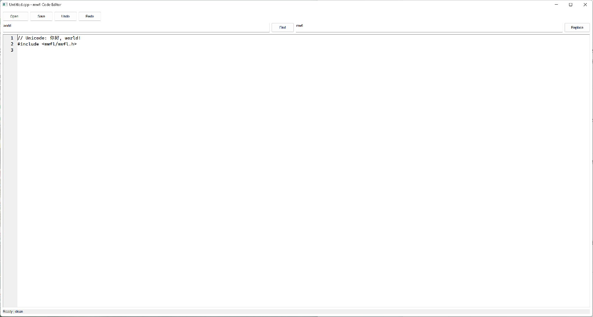

# Code Editor

This compiled example demonstrates **optional pinned Scintilla code editor with Unicode files search replace notifications and dirty state**. It is intentionally small
enough to study from the source while still using real native Windows controls,
messages, and ownership rules.



## What it demonstrates

- `ScintillaRuntime`
- `ScintillaEditor`
- `ScintillaNotification`
- `DocumentState`

The window remains a real HWND and the example preserves mwfl's native escape
hatch. UI objects stay on their creating thread, and no exception is allowed to
cross a Win32 callback.

## Key code

The following excerpt is quoted directly from [`main.cpp`](main.cpp):

```cpp
class CodeEditorWindow final : public mwfl::WindowBase {
public:
    void BuildUI() override {
        SetTitle(L"mwfl Code Editor");
        if (!runtime_.LoadAdjacent()) {
            throw std::runtime_error(
                "Scintilla.dll is unavailable beside the executable; enable "
                "MWFL_BUILD_SCINTILLA and use mwfl_deploy_scintilla(target)");
        }

        mwfl::ControlHost ui{*this};
        ui.Add(open_, kOpen, L"Open...");
        ui.Add(save_, kSave, L"Save");
        ui.Add(undo_, kUndo, L"Undo");
        ui.Add(redo_, kRedo, L"Redo");
        ui.Add(search_, kSearch, L"world");
        ui.Add(find_, kFind, L"Find");
        ui.Add(replacement_, kReplacement, L"mwfl");
```

Read the complete implementation in [`main.cpp`](main.cpp).

## Build and run

From a Visual Studio developer PowerShell at the repository root:

```powershell
cmake --preset vs2026-x64-optional
cmake --build --preset vs2026-x64-optional-debug --target mwfl_code_editor_demo
build\presets\vs2026-x64-optional\examples\code_editor\Debug\mwfl_code_editor_demo.exe
```

Visual Studio 2022 remains supported; substitute the `vs2022-x64` configure and
build presets when validating that toolchain. This example uses the optional `scintilla` component; the optional preset shown above enables its pinned dependency and runtime staging rules.

## Validation

The focused validation targets are `mwfl.scintilla_text`, `mwfl.scintilla_native`, `mwfl.code_editor_gui`. Run `./scripts/verify-change.ps1 -Execute` after modifying it so
the repository selects the additional checks required by the changed paths.
