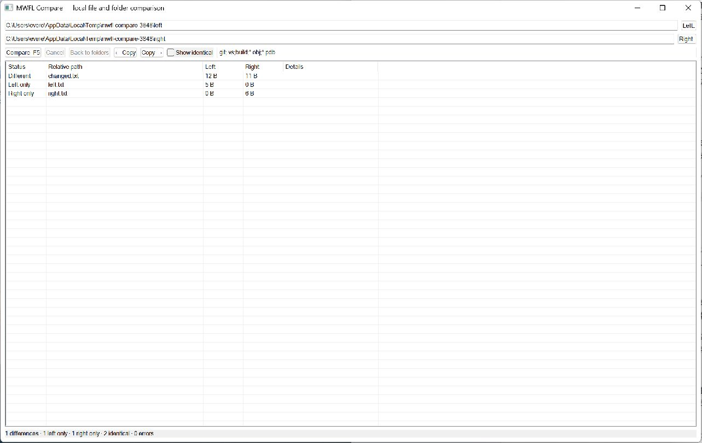

# Compare Tool

A native Windows file and folder comparison application inspired by the
local-first workflow of [GrapeCompare](https://github.com/everettjf/grapecompare).
It compares directory trees exactly, previews text changes side by side, and
performs explicitly confirmed, byte-verified copies.



## Try it

Build the `mwfl_compare_tool` target, then paste, browse, or drop two paths into
the window. Two directories start a recursive comparison; two files open the
side-by-side text view. Press `F5` to compare, activate a changed row to inspect
it, and use **Back to folders** to return.

For a populated, disposable demonstration:

```powershell
build\presets\vs2026-x64\examples\compare_tool\Debug\mwfl_compare_tool.exe --showcase
```

## Key code

Folder work runs off the UI thread and reports progress through a safe mwfl
window wakeup:

```cpp
const mwfl::WindowWakeup wake = GetWakeup();
worker_ = std::jthread([this, left, right, options, wake] {
    auto result = compare_tool::CompareFolders(
        left, right, options, &cancel_,
        [this, wake](std::size_t scanned, std::wstring_view current) {
            {
                std::scoped_lock lock(worker_mutex_);
                progress_text_ = L"Scanned " + std::to_wstring(scanned) +
                                 L" items · " + std::wstring(current);
            }
            wake.TryWake();
        });
    // Store the completed result under worker_mutex_, then wake the UI.
});
```

Matching files are never accepted from timestamps alone. A size precheck is
followed by bounded byte reads with cancellation between chunks:

```cpp
std::array<char, 64 * 1024> a{}, b{};
while (first && second) {
    if (cancel != nullptr && cancel->load(std::memory_order_relaxed)) return false;
    first.read(a.data(), static_cast<std::streamsize>(a.size()));
    second.read(b.data(), static_cast<std::streamsize>(b.size()));
    const auto first_count = first.gcount();
    const auto second_count = second.gcount();
    if (first_count != second_count ||
        !std::equal(a.begin(), a.begin() + first_count, b.begin()))
        return false;
}
```

Copying uses a sibling temporary file, verifies the copied bytes, and only then
replaces the destination with a write-through move. See
[`compare_model.cpp`](compare_model.cpp) for the complete preflight and cleanup
path, and [`main.cpp`](main.cpp) for virtual-list and worker handoff code.

## Product boundaries

- Recursive scanning supports exclusions, cancellation, symlink comparison,
  type conflicts, and visible filesystem errors.
- Text preview detects binary input, reports final-newline differences, and
  bounds large-file memory use.
- Copy direction is explicit and requires confirmation; symlinks are not
  followed implicitly.
- This version does not claim three-way merge, Git integration, plan files, or
  durable undo history.

The full contract and validation notes are in
[`docs/tutorials/compare-tool.md`](../../docs/tutorials/compare-tool.md).
