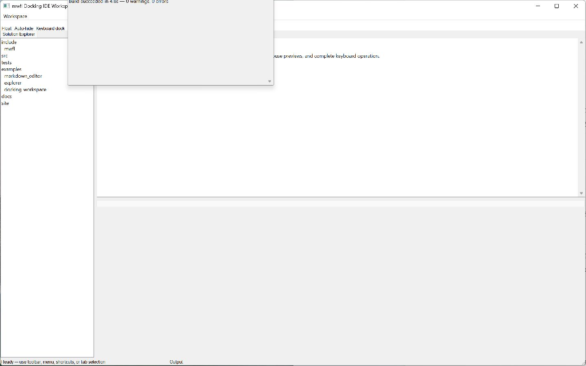

# Docking Workspace

This compiled example demonstrates **IDE-style document and tool workspace with docking floating auto-hide keyboard navigation and persistent layout**. It is intentionally small
enough to study from the source while still using real native Windows controls,
messages, and ownership rules.



## What it demonstrates

- `DockLayoutModel`
- `DockNativeWorkspaceAdapter`
- `DockDragSession`
- `DockPreviewWindow`
- `DockFloatingWindow`
- `DockAutoHideController`
- `DockKeyboardSession`
- `SaveDockingSessionAtomic`

The window remains a real HWND and the example preserves mwfl's native escape
hatch. UI objects stay on their creating thread, and no exception is allowed to
cross a Win32 callback.

## Key code

The following excerpt is quoted directly from [`main.cpp`](main.cpp):

```cpp
class DockingIdeWindow final : public mwfl::WindowBase {
public:
    DockingIdeWindow()
        : model_{kDocuments, {100}, mwfl::DockGroupRole::document} {
        const auto defaults = DefaultLayout();
        mwfl::Must(static_cast<bool>(model_.Replace(defaults)), "initialize docking model");
    }

    void BuildUI() override {
        BuildCommands();
        mwfl::ControlHost controls{*this};
        controls.Add(toolbar_);
        controls.Add(status_);
        for (const mwfl::ControlId id :
             {kFloatOutput, kAutoHideExplorer, kKeyboardDock, kSaveLayout})
            mwfl::Must(toolbar_.AddCommand(*commands_.Find(id)),
                       "add primary docking toolbar command");
        toolbar_.AutoSize();
```

Read the complete implementation in [`main.cpp`](main.cpp).

## Build and run

From a Visual Studio developer PowerShell at the repository root:

```powershell
cmake --preset vs2026-x64
cmake --build --preset vs2026-x64-debug --target mwfl_docking_workspace_demo
build\presets\vs2026-x64\examples\docking_workspace\Debug\mwfl_docking_workspace_demo.exe
```

Visual Studio 2022 remains supported; substitute the `vs2022-x64` configure and
build presets when validating that toolchain.

## Validation

The focused validation targets are `mwfl.docking_workspace`, `mwfl.docking_native`, `mwfl.docking_session`, `mwfl.docking_monitor`, `mwfl.docking_drag`, `mwfl.docking_preview_native`, `mwfl.docking_auto_hide`, `mwfl.docking_keyboard`, `mwfl.docking_floating_native`, `mwfl.docking_stress_native`, `mwfl.docking_workspace_gui`. Run `./scripts/verify-change.ps1 -Execute` after modifying it so
the repository selects the additional checks required by the changed paths.
