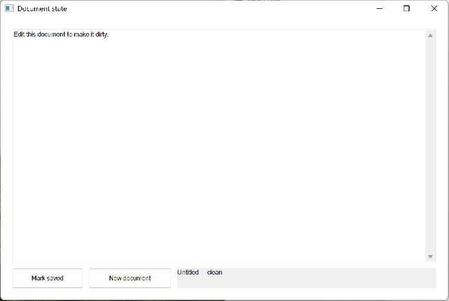

# Document State

This compiled example demonstrates **document dirty state and safe transition decisions**. It is intentionally small
enough to study from the source while still using real native Windows controls,
messages, and ownership rules.



## What it demonstrates

- `DocumentState`
- `DocumentTransition`

The window remains a real HWND and the example preserves mwfl's native escape
hatch. UI objects stay on their creating thread, and no exception is allowed to
cross a Win32 callback.

## Key code

The following excerpt is quoted directly from [`main.cpp`](main.cpp):

```cpp
class DocumentStateWindow final : public mwfl::WindowBase {
public:
    void BuildUI() override {
        mwfl::ControlHost ui{*this};
        mwfl::TextBoxOptions editor_options;
        editor_options.style |= ES_MULTILINE | ES_AUTOVSCROLL | WS_VSCROLL;
        ui.Add(editor_, L"Edit this document to make it dirty.", editor_options);
        ui.Add(save_, L"Mark saved");
        ui.Add(reset_, L"New document");
        ui.Add(status_, L"Untitled — clean");
        SetLayout(mwfl::Column().Margin(20.0_dip).Gap(10.0_dip)
            .Add(editor_, mwfl::Stretch())
            .Add(mwfl::Row().Gap(10.0_dip)
                .Add(save_, mwfl::Fixed(120.0_dip))
                .Add(reset_, mwfl::Fixed(140.0_dip))
                .Add(status_, mwfl::Stretch()), mwfl::Fixed(34.0_dip)));
    }
```

Read the complete implementation in [`main.cpp`](main.cpp).

## Build and run

From a Visual Studio developer PowerShell at the repository root:

```powershell
cmake --preset vs2026-x64
cmake --build --preset vs2026-x64-debug --target mwfl_document_state_demo
build\presets\vs2026-x64\examples\document_state\Debug\mwfl_document_state_demo.exe
```

Visual Studio 2022 remains supported; substitute the `vs2022-x64` configure and
build presets when validating that toolchain.

## Validation

This example is compiled in both Debug and Release and participates in the example catalog checks. Run `./scripts/verify-change.ps1 -Execute` after modifying it so
the repository selects the additional checks required by the changed paths.
