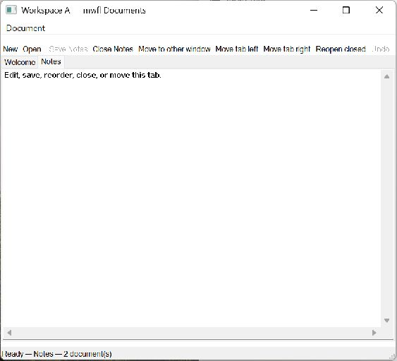

# Document Workspace

This compiled example demonstrates **two-window multi-document editor with stable tabs transfer session restore and coordinated close**. It is intentionally small
enough to study from the source while still using real native Windows controls,
messages, and ownership rules.



## What it demonstrates

- `DocumentWorkspaceModel`
- `DocumentTabWorkspaceAdapter`
- `TransferDocumentWithPage`
- `DocumentSession`
- `CoordinatedClosePlan`

The window remains a real HWND and the example preserves mwfl's native escape
hatch. UI objects stay on their creating thread, and no exception is allowed to
cross a Win32 callback.

## Key code

The following excerpt is quoted directly from [`main.cpp`](main.cpp):

```cpp
class WorkspaceWindow;

struct DocumentContent {
    std::wstring text;
    std::optional<mwfl::FileStamp> stamp;
};

struct Coordinator {
    explicit Coordinator(bool test, std::optional<std::filesystem::path> result)
        : self_test(test), result_path(std::move(result)) {
        if (self_test) {
            session_path = std::filesystem::temp_directory_path() /
                (L"mwfl-document-workspace-app-session-" +
                 std::to_wstring(::GetCurrentProcessId()) + L".state");
            std::error_code ignored;
            std::filesystem::remove(session_path, ignored);
        } else {
            std::array<wchar_t, 32768> local{};
```

Read the complete implementation in [`main.cpp`](main.cpp).

## Build and run

From a Visual Studio developer PowerShell at the repository root:

```powershell
cmake --preset vs2026-x64
cmake --build --preset vs2026-x64-debug --target mwfl_document_workspace
build\presets\vs2026-x64\examples\document_workspace\Debug\mwfl_document_workspace.exe
```

Visual Studio 2022 remains supported; substitute the `vs2022-x64` configure and
build presets when validating that toolchain.

## Validation

The focused validation targets are `mwfl.document_workspace_gui`. Run `./scripts/verify-change.ps1 -Execute` after modifying it so
the repository selects the additional checks required by the changed paths.
