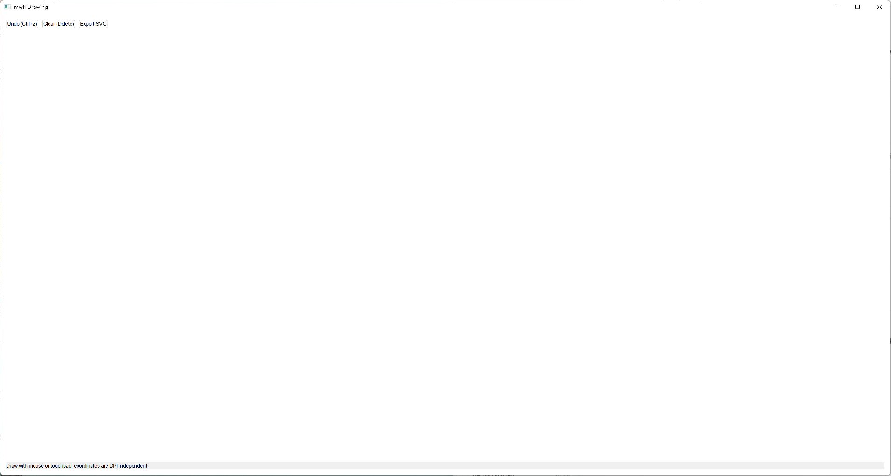

# Drawing

This compiled example demonstrates **DPI-aware Direct2D drawing with device-resource recovery and SVG export**. It is intentionally small
enough to study from the source while still using real native Windows controls,
messages, and ownership rules.



## What it demonstrates

- `D2DHost`
- `D2DRenderContext`
- `D2DRenderStateModel`

The window remains a real HWND and the example preserves mwfl's native escape
hatch. UI objects stay on their creating thread, and no exception is allowed to
cross a Win32 callback.

## Key code

The following excerpt is quoted directly from [`main.cpp`](main.cpp):

```cpp
class DrawingWindow final : public mwfl::WindowBase {
public:
    void BuildUI() override {
        SetTitle(L"mwfl Drawing");
        mwfl::ControlHost ui{*this};
        ui.Add(undo_, kUndo, L"Undo (Ctrl+Z)", {0.0_dip, 0.0_dip, 120.0_dip, 32.0_dip});
        ui.Add(clear_, kClear, L"Clear (Delete)", {0.0_dip, 0.0_dip, 120.0_dip, 32.0_dip});
        ui.Add(export_, kExport, L"Export SVG", {0.0_dip, 0.0_dip, 120.0_dip, 32.0_dip});
        ui.Add(status_, L"Draw with mouse or touchpad; coordinates are DPI-independent.");

        mwfl::D2DHostOptions options;
        options.callbacks.create_device_resources = [this](ID2D1HwndRenderTarget& target) {
            const HRESULT result = target.CreateSolidColorBrush(
                D2D1::ColorF(D2D1::ColorF::RoyalBlue), brush_.ReleaseAndGetAddressOf());
            if (FAILED(result)) throw std::runtime_error("create drawing brush failed");
        };
        options.callbacks.discard_device_resources = [this] { brush_.Reset(); };
        options.callbacks.paint = [this](mwfl::D2DRenderContext& context) {
```

Read the complete implementation in [`drawing_model.cpp`](drawing_model.cpp), [`drawing_model.h`](drawing_model.h), [`main.cpp`](main.cpp).

## Build and run

From a Visual Studio developer PowerShell at the repository root:

```powershell
cmake --preset vs2026-x64
cmake --build --preset vs2026-x64-debug --target mwfl_drawing_demo
build\presets\vs2026-x64\examples\drawing\Debug\mwfl_drawing_demo.exe
```

Visual Studio 2022 remains supported; substitute the `vs2022-x64` configure and
build presets when validating that toolchain.

## Validation

The focused validation targets are `mwfl.d2d_host_model`, `mwfl.d2d_host_native`, `mwfl.drawing_model`, `mwfl.drawing_gui`. Run `./scripts/verify-change.ps1 -Execute` after modifying it so
the repository selects the additional checks required by the changed paths.
