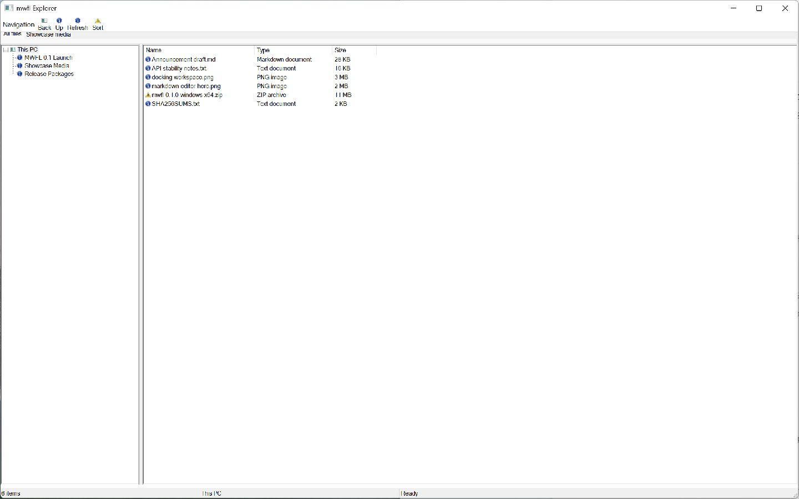

# Explorer

This compiled example demonstrates **Explorer-style native shell with stable navigation and virtual data**. It is intentionally small
enough to study from the source while still using real native Windows controls,
messages, and ownership rules.



## What it demonstrates

- `Rebar`
- `Toolbar`
- `Splitter`
- `TreeView`
- `VirtualListModel`
- `TabControl`
- `StatusBar`
- `ImageList`
- `Menu`

The window remains a real HWND and the example preserves mwfl's native escape
hatch. UI objects stay on their creating thread, and no exception is allowed to
cross a Win32 callback.

## Key code

The following excerpt is quoted directly from [`main.cpp`](main.cpp):

```cpp
class ExplorerWindow final : public mwfl::WindowBase {
public:
    void BuildUI() override {
        SetTitle(L"mwfl Explorer");
        BuildImagesAndCommands();

        mwfl::ControlHost ui{*this};
        ui.Add(rebar_, {200}, {0.0_dip, 0.0_dip, 980.0_dip, 32.0_dip});
        mwfl::ControlHost rebar_ui{rebar_};
        rebar_ui.Add(toolbar_, {201}, {0.0_dip, 0.0_dip, 420.0_dip, 28.0_dip});
        ui.Add(tabs_, {202}, {0.0_dip, 32.0_dip, 980.0_dip, 28.0_dip});
        ui.Add(splitter_, {203}, {0.0_dip, 60.0_dip, 980.0_dip, 556.0_dip},
               mwfl::SplitterOptions{.constraints = {180.0_dip, 320.0_dip, 6.0_dip},
                                     .initial_position = 250.0_dip});
        mwfl::ControlHost panes{splitter_};
        panes.Add(tree_, {204}, mwfl::RectDip{});
        panes.Add(list_, {205}, mwfl::RectDip{},
                  mwfl::ListViewOptions{.virtual_data = true});
```

Read the complete implementation in [`explorer_model.cpp`](explorer_model.cpp), [`explorer_model.h`](explorer_model.h), [`main.cpp`](main.cpp).

## Build and run

From a Visual Studio developer PowerShell at the repository root:

```powershell
cmake --preset vs2026-x64
cmake --build --preset vs2026-x64-debug --target mwfl_explorer_demo
build\presets\vs2026-x64\examples\explorer\Debug\mwfl_explorer_demo.exe
```

Visual Studio 2022 remains supported; substitute the `vs2022-x64` configure and
build presets when validating that toolchain.

## Validation

The focused validation targets are `mwfl.explorer_model`, `mwfl.explorer_gui`, `mwfl.splitter_native`, `mwfl.navigation_native`. Run `./scripts/verify-change.ps1 -Execute` after modifying it so
the repository selects the additional checks required by the changed paths.
