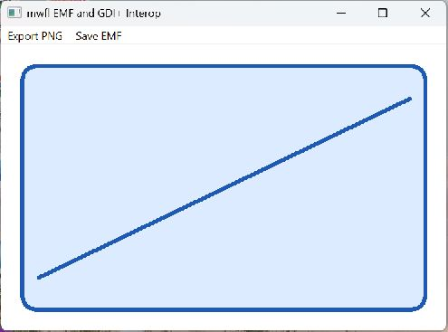

# Graphics Interop

This compiled example demonstrates **enhanced metafile record playback and bounded atomic GDI plus PNG export**. It is intentionally small
enough to study from the source while still using real native Windows controls,
messages, and ownership rules.



## What it demonstrates

- `EnhancedMetafile`
- `RecordEnhancedMetafile`
- `PlayEnhancedMetafile`
- `GdiPlusSession`
- `ExportGdiPlusPng`

The window remains a real HWND and the example preserves mwfl's native escape
hatch. UI objects stay on their creating thread, and no exception is allowed to
cross a Win32 callback.

## Key code

The following excerpt is quoted directly from [`main.cpp`](main.cpp):

```cpp
        auto recorded = mwfl::RecordEnhancedMetafile(nullptr, L"mwfl graphics", [](HDC dc) {
            HPEN pen = ::CreatePen(PS_SOLID, 5, RGB(30, 90, 180));
            HBRUSH brush = ::CreateSolidBrush(RGB(220, 235, 255));
            HGDIOBJ old_pen = ::SelectObject(dc, pen);
            HGDIOBJ old_brush = ::SelectObject(dc, brush);
            ::RoundRect(dc, 20, 20, 520, 320, 32, 32);
            ::MoveToEx(dc, 40, 280, nullptr);
            ::LineTo(dc, 500, 60);
            ::SelectObject(dc, old_brush);
            ::SelectObject(dc, old_pen);
            ::DeleteObject(brush);
            ::DeleteObject(pen);
        });
        if (!recorded) return Fail(L"EMF recording failed");
        metafile_ = std::move(recorded.metafile);
        ::ShowWindow(frame_, self_test_ ? SW_HIDE : show);
        ::UpdateWindow(frame_);
        if (self_test_) ::PostMessageW(frame_, RunSelfTest, 0, 0);
```

Read the complete implementation in [`main.cpp`](main.cpp).

## Build and run

From a Visual Studio developer PowerShell at the repository root:

```powershell
cmake --preset vs2026-x64-optional
cmake --build --preset vs2026-x64-optional-debug --target mwfl_graphics_interop
build\presets\vs2026-x64-optional\examples\graphics_interop\Debug\mwfl_graphics_interop.exe
```

Visual Studio 2022 remains supported; substitute the `vs2022-x64` configure and
build presets when validating that toolchain. This example uses the optional `graphics` component; the optional preset shown above enables its pinned dependency and runtime staging rules.

## Validation

The focused validation targets are `mwfl.graphics`, `mwfl.graphics_interop_gui`. Run `./scripts/verify-change.ps1 -Execute` after modifying it so
the repository selects the additional checks required by the changed paths.
