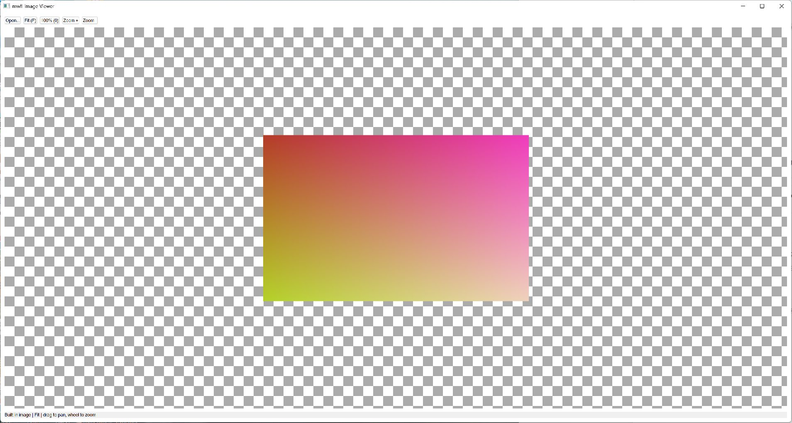

# Image Viewer

This compiled example demonstrates **bounded color-aware WIC decode with DPI-aware Fit zoom pan and recoverable D2D rendering**. It is intentionally small
enough to study from the source while still using real native Windows controls,
messages, and ownership rules.



## What it demonstrates

- `DecodedImage`
- `DecodeImageFile`
- `ImageViewportModel`
- `D2DHost`

The window remains a real HWND and the example preserves mwfl's native escape
hatch. UI objects stay on their creating thread, and no exception is allowed to
cross a Win32 callback.

## Key code

The following excerpt is quoted directly from [`main.cpp`](main.cpp):

```cpp
class ImageViewerWindow final : public mwfl::WindowBase {
public:
    void BuildUI() override {
        SetTitle(L"mwfl Image Viewer");
        image_ = MakeWelcomeImage();
        viewport_.SetImageSize(image_.width, image_.height);
        viewport_.SetViewport({900.0_dip, 560.0_dip});
        viewport_.Fit();

        mwfl::ControlHost ui{*this};
        ui.Add(open_, kOpen, L"Open...", {0.0_dip, 0.0_dip, 90.0_dip, 32.0_dip});
        ui.Add(fit_, kFit, L"Fit (F)", {0.0_dip, 0.0_dip, 80.0_dip, 32.0_dip});
        ui.Add(actual_, kActual, L"100% (0)", {0.0_dip, 0.0_dip, 90.0_dip, 32.0_dip});
        ui.Add(zoom_in_, kZoomIn, L"Zoom +", {0.0_dip, 0.0_dip, 80.0_dip, 32.0_dip});
        ui.Add(zoom_out_, kZoomOut, L"Zoom -", {0.0_dip, 0.0_dip, 80.0_dip, 32.0_dip});
        ui.Add(status_, L"Built-in image | Fit | drag to pan, wheel to zoom");

        mwfl::D2DHostOptions options;
```

Read the complete implementation in [`main.cpp`](main.cpp).

## Build and run

From a Visual Studio developer PowerShell at the repository root:

```powershell
cmake --preset vs2026-x64
cmake --build --preset vs2026-x64-debug --target mwfl_image_viewer_demo
build\presets\vs2026-x64\examples\image_viewer\Debug\mwfl_image_viewer_demo.exe
```

Visual Studio 2022 remains supported; substitute the `vs2022-x64` configure and
build presets when validating that toolchain.

## Validation

The focused validation targets are `mwfl.imaging_model`, `mwfl.imaging_decode`, `mwfl.image_viewer_gui`, `mwfl.d2d_host_native`. Run `./scripts/verify-change.ps1 -Execute` after modifying it so
the repository selects the additional checks required by the changed paths.
