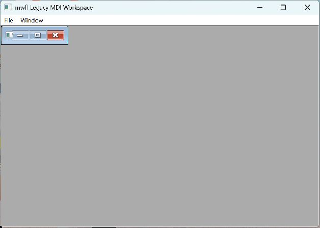

# MDI Workspace

This compiled example demonstrates **optional traditional MDI with stable child identity active command routing arrangement and atomic dirty close**. It is intentionally small
enough to study from the source while still using real native Windows controls,
messages, and ownership rules.



## What it demonstrates

- `MdiWorkspaceModel`
- `MdiHost`
- `RouteMdiActiveChild`

The window remains a real HWND and the example preserves mwfl's native escape
hatch. UI objects stay on their creating thread, and no exception is allowed to
cross a Win32 callback.

## Key code

The following excerpt is quoted directly from [`main.cpp`](main.cpp):

```cpp
        case CommandCascade: host_.Arrange(mwfl::MdiArrange::cascade); break;
        case CommandTileHorizontal: host_.Arrange(mwfl::MdiArrange::tile_horizontal); break;
        case CommandTileVertical: host_.Arrange(mwfl::MdiArrange::tile_vertical); break;
        case CommandExit: ::SendMessageW(frame_, WM_CLOSE, 0, 0); break;
        default: return host_.FrameDefault(WM_COMMAND, command, 0);
        }
        return 0;
    }

    void CreateDocument() {
        const mwfl::MdiChildId id{next_id_++};
        const std::wstring title = L"Document " + std::to_wstring(id.value);
        if (!model_.Add({id, title})) { FailSelfTest(L"model add failed"); return; }
        auto created = host_.CreateChild(id, {WS_VISIBLE | WS_OVERLAPPEDWINDOW,
            [this, id](HWND window, UINT message, WPARAM, LPARAM)
                -> std::optional<LRESULT> {
                if (message == WM_PAINT) {
                    PAINTSTRUCT paint{};
```

Read the complete implementation in [`main.cpp`](main.cpp).

## Build and run

From a Visual Studio developer PowerShell at the repository root:

```powershell
cmake --preset vs2026-x64-optional
cmake --build --preset vs2026-x64-optional-debug --target mwfl_mdi_workspace
build\presets\vs2026-x64-optional\examples\mdi_workspace\Debug\mwfl_mdi_workspace.exe
```

Visual Studio 2022 remains supported; substitute the `vs2022-x64` configure and
build presets when validating that toolchain. This example uses the optional `mdi` component; the optional preset shown above enables its pinned dependency and runtime staging rules.

## Validation

The focused validation targets are `mwfl.mdi_model`, `mwfl.mdi_native`, `mwfl.mdi_workspace_gui`. Run `./scripts/verify-change.ps1 -Execute` after modifying it so
the repository selects the additional checks required by the changed paths.
