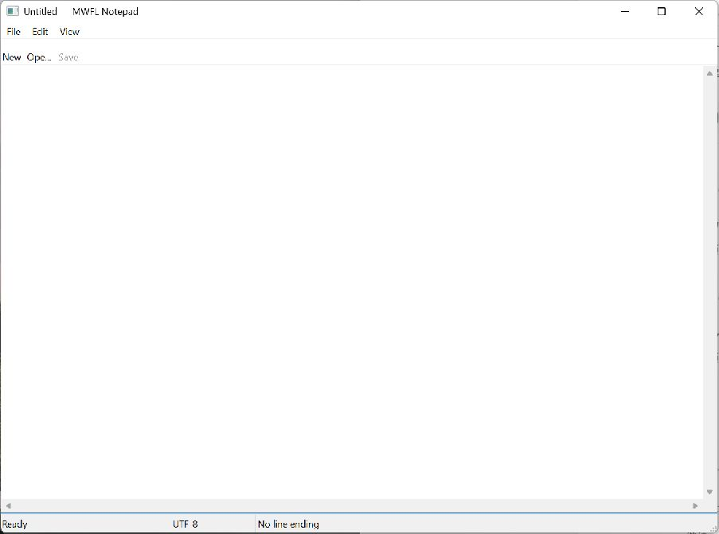

# Notepad

This compiled example demonstrates **accessible DPI-aware SDI text editor with safe Unicode open and atomic save**. It is intentionally small
enough to study from the source while still using real native Windows controls,
messages, and ownership rules.



## What it demonstrates

- `DocumentState`
- `ReadTextFile`
- `WriteTextFileAtomic`
- `CommandSet`
- `StatusBar`
- `SetAccessibleName`

The window remains a real HWND and the example preserves mwfl's native escape
hatch. UI objects stay on their creating thread, and no exception is allowed to
cross a Win32 callback.

## Key code

The following excerpt is quoted directly from [`main.cpp`](main.cpp):

```cpp
class NotepadWindow final : public mwfl::WindowBase {
   public:
    NotepadWindow(mwfl::SingleInstance& instance, std::optional<std::filesystem::path> initial_path,
                  bool self_test, std::optional<std::filesystem::path> self_test_result)
        : instance_(instance),
          initial_path_(std::move(initial_path)),
          self_test_(self_test),
          self_test_result_(std::move(self_test_result)) {}

    void BuildUI() override {
        if (!self_test_) {
            const auto loaded = mwfl::LoadRecentFilesFromRegistry(HKEY_CURRENT_USER, kSettingsKey,
                                                                  recent_.GetMaximumEntries());
            if (loaded.Succeeded()) recent_ = std::move(*loaded.value);
            always_on_top_ =
                LoadBoolSetting(HKEY_CURRENT_USER, kSettingsKey, L"AlwaysOnTop").value_or(false);
        }
        BuildCommands();
```

Read the complete implementation in [`main.cpp`](main.cpp).

## Build and run

From a Visual Studio developer PowerShell at the repository root:

```powershell
cmake --preset vs2026-x64
cmake --build --preset vs2026-x64-debug --target mwfl_notepad
build\presets\vs2026-x64\examples\notepad\Debug\mwfl_notepad.exe
```

Visual Studio 2022 remains supported; substitute the `vs2022-x64` configure and
build presets when validating that toolchain.

## Validation

The focused validation targets are `mwfl.notepad_gui`. Run `./scripts/verify-change.ps1 -Execute` after modifying it so
the repository selects the additional checks required by the changed paths.
