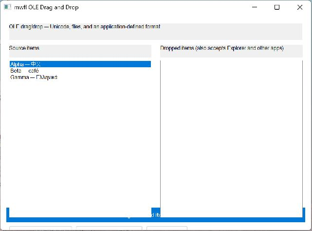

# OLE Drag Drop

This compiled example demonstrates **OLE STA drag source and drop target with Unicode files custom formats effect negotiation and keyboard alternatives**. It is intentionally small
enough to study from the source while still using real native Windows controls,
messages, and ownership rules.



## What it demonstrates

- `OleDataObjectBuilder`
- `CreateOleDropSource`
- `CreateOleDropTarget`
- `OleDropTargetRegistration`
- `DoOleDragDrop`

The window remains a real HWND and the example preserves mwfl's native escape
hatch. UI objects stay on their creating thread, and no exception is allowed to
cross a Win32 callback.

## Key code

The following excerpt is quoted directly from [`main.cpp`](main.cpp):

```cpp
class DragDropWindow final : public mwfl::WindowBase {
public:
    void BuildUI() override {
        SetTitle(L"mwfl OLE Drag and Drop");
        ::SetWindowPos(GetHwnd(), nullptr, 0, 0, 980, 720,
                       SWP_NOMOVE | SWP_NOZORDER | SWP_NOACTIVATE);
        custom_format_ = mwfl::RegisterOleFormat(L"mwfl.example.item.v1");
        if (!custom_format_) throw std::runtime_error("register custom OLE format failed");

        mwfl::ControlHost ui{*this};
        ui.Add(title_, L"OLE drag/drop — Unicode, files, and an application-defined format");
        ui.Add(source_label_, L"Source items");
        ui.Add(source_, kSource, {0.0_dip, 0.0_dip, 300.0_dip, 300.0_dip});
        ui.Add(destination_label_, L"Dropped items (also accepts Explorer and other apps)");
        ui.Add(destination_, kDestination, {0.0_dip, 0.0_dip, 300.0_dip, 300.0_dip});
        ui.Add(copy_, kCopy, L"Copy selected (Ctrl+Enter)",
               {0.0_dip, 0.0_dip, 180.0_dip, 32.0_dip});
        ui.Add(move_, kMove, L"Move selected (Shift+Enter)",
```

Read the complete implementation in [`main.cpp`](main.cpp).

## Build and run

From a Visual Studio developer PowerShell at the repository root:

```powershell
cmake --preset vs2026-x64-optional
cmake --build --preset vs2026-x64-optional-debug --target mwfl_ole_drag_drop_demo
build\presets\vs2026-x64-optional\examples\ole_drag_drop\Debug\mwfl_ole_drag_drop_demo.exe
```

Visual Studio 2022 remains supported; substitute the `vs2022-x64` configure and
build presets when validating that toolchain. This example uses the optional `ole` component; the optional preset shown above enables its pinned dependency and runtime staging rules.

## Validation

The focused validation targets are `mwfl.ole_data`, `mwfl.ole_drag_drop`, `mwfl.ole_drag_drop_gui`. Run `./scripts/verify-change.ps1 -Execute` after modifying it so
the repository selects the additional checks required by the changed paths.
