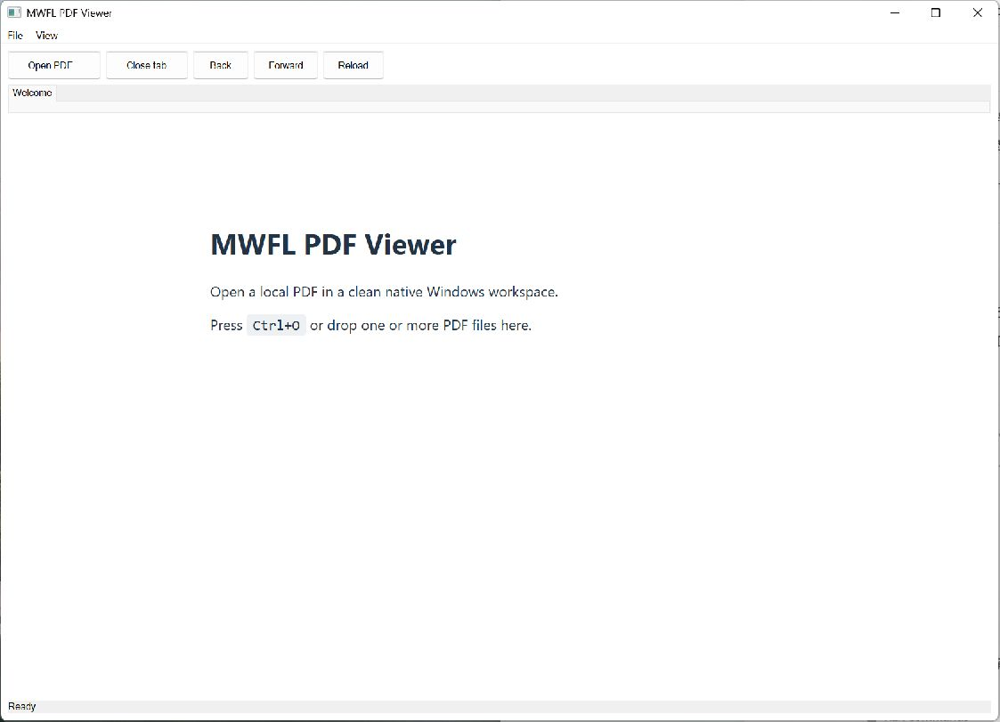

# PDF Viewer

This compiled example demonstrates **product-style local PDF viewer with native document tabs drag-and-drop window placement and WebView2 process recovery**. It is intentionally small
enough to study from the source while still using real native Windows controls,
messages, and ownership rules.



## What it demonstrates

- `WebView2Host`
- `TabWorkspaceModel`
- `TabControl`
- `CommandSet`
- `ShowOpenFileDialog`

The window remains a real HWND and the example preserves mwfl's native escape
hatch. UI objects stay on their creating thread, and no exception is allowed to
cross a Win32 callback.

## Key code

The following excerpt is quoted directly from [`main.cpp`](main.cpp):

```cpp
class PdfViewerWindow final : public mwfl::WindowBase {
   public:
    void BuildUI() override {
        self_test_ =
            std::wstring_view{::GetCommandLineW()}.find(L"--self-test") != std::wstring_view::npos;
        if (!self_test_) {
            const auto loaded = mwfl::LoadRecentFilesFromRegistry(HKEY_CURRENT_USER, kSettingsKey,
                                                                  recent_.GetMaximumEntries());
            if (loaded.Succeeded()) recent_ = std::move(*loaded.value);
        }
        SetTitle(L"MWFL PDF Viewer");
        BuildCommands();
        RefreshRecentCommands();
        mwfl::ControlHost ui{*this};
        ui.Add(open_, kOpen, L"Open PDF...");
        ui.Add(close_tab_, kCloseTab, L"Close tab");
        ui.Add(back_, kBack, L"Back");
        ui.Add(forward_, kForward, L"Forward");
```

Read the complete implementation in [`main.cpp`](main.cpp).

## Build and run

From a Visual Studio developer PowerShell at the repository root:

```powershell
cmake --preset vs2026-x64-optional
cmake --build --preset vs2026-x64-optional-debug --target mwfl_pdf_viewer
build\presets\vs2026-x64-optional\examples\pdf_viewer\Debug\mwfl_pdf_viewer.exe
```

Visual Studio 2022 remains supported; substitute the `vs2022-x64` configure and
build presets when validating that toolchain. This example uses the optional `webview2` component; the optional preset shown above enables its pinned dependency and runtime staging rules.

## Validation

The focused validation targets are `mwfl.pdf_viewer_gui`, `mwfl.webview2_native`. Run `./scripts/verify-change.ps1 -Execute` after modifying it so
the repository selects the additional checks required by the changed paths.
