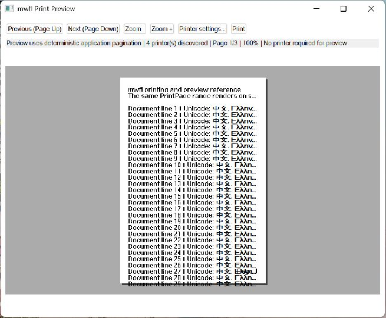

# Printing

This compiled example demonstrates **printer-independent pagination and preview with safe native print transactions and deterministic fallback**. It is intentionally small
enough to study from the source while still using real native Windows controls,
messages, and ownership rules.



## What it demonstrates

- `PrintPage`
- `PrintPreviewModel`
- `PrinterSettings`
- `PrintJob`
- `PrintPages`

The window remains a real HWND and the example preserves mwfl's native escape
hatch. UI objects stay on their creating thread, and no exception is allowed to
cross a Win32 callback.

## Key code

The following excerpt is quoted directly from [`main.cpp`](main.cpp):

```cpp
class PrintingWindow final : public mwfl::WindowBase {
public:
    void BuildUI() override {
        SetTitle(L"mwfl Print Preview");
        ::SetWindowPos(GetHwnd(), nullptr, 0, 0, 1000, 820,
                       SWP_NOMOVE | SWP_NOZORDER | SWP_NOACTIVATE);
        lines_ = MakeDocument();
        pages_ = mwfl::PaginateContent(static_cast<std::int64_t>(lines_.size()), 32);
        preview_.SetPageCount(pages_.size());

        mwfl::ControlHost ui{*this};
        ui.Add(previous_, kPrevious, L"Previous (Page Up)", {0.0_dip, 0.0_dip, 130.0_dip, 32.0_dip});
        ui.Add(next_, kNext, L"Next (Page Down)", {0.0_dip, 0.0_dip, 120.0_dip, 32.0_dip});
        ui.Add(zoom_out_, kZoomOut, L"Zoom -", {0.0_dip, 0.0_dip, 80.0_dip, 32.0_dip});
        ui.Add(zoom_in_, kZoomIn, L"Zoom +", {0.0_dip, 0.0_dip, 80.0_dip, 32.0_dip});
        ui.Add(settings_button_, kSettings, L"Printer settings...",
               {0.0_dip, 0.0_dip, 135.0_dip, 32.0_dip});
        ui.Add(print_, kPrint, L"Print", {0.0_dip, 0.0_dip, 80.0_dip, 32.0_dip});
```

Read the complete implementation in [`main.cpp`](main.cpp).

## Build and run

From a Visual Studio developer PowerShell at the repository root:

```powershell
cmake --preset vs2026-x64-optional
cmake --build --preset vs2026-x64-optional-debug --target mwfl_printing_demo
build\presets\vs2026-x64-optional\examples\printing\Debug\mwfl_printing_demo.exe
```

Visual Studio 2022 remains supported; substitute the `vs2022-x64` configure and
build presets when validating that toolchain. This example uses the optional `printing` component; the optional preset shown above enables its pinned dependency and runtime staging rules.

## Validation

The focused validation targets are `mwfl.printing_model`, `mwfl.printing_job`, `mwfl.printing_settings`, `mwfl.printing_gui`. Run `./scripts/verify-change.ps1 -Execute` after modifying it so
the repository selects the additional checks required by the changed paths.
