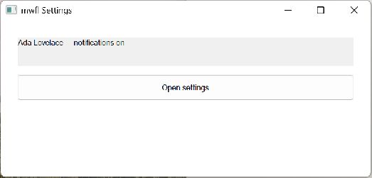

# Property Sheet

This compiled example demonstrates **persistent modeless multi-page settings with validation and Apply/OK/Cancel**. It is intentionally small
enough to study from the source while still using real native Windows controls,
messages, and ownership rules.



## What it demonstrates

- `PropertyPage`
- `PropertySheetDialog`
- `PropertySheetResult`
- `ShowTaskDialog`

The window remains a real HWND and the example preserves mwfl's native escape
hatch. UI objects stay on their creating thread, and no exception is allowed to
cross a Win32 callback.

## Key code

The following excerpt is quoted directly from [`main.cpp`](main.cpp):

```cpp
class PropertySheetWindow final : public mwfl::WindowBase {
public:
    void BuildUI() override {
        SetTitle(L"mwfl Settings");
        mwfl::ControlHost ui{*this};
        ui.Add(summary_, L"");
        ui.Add(open_, L"Open settings");
        SetLayout(mwfl::Column()
                      .Margin(24.0_dip)
                      .Gap(12.0_dip)
                      .Add(summary_, mwfl::Fixed(40.0_dip))
                      .Add(open_, mwfl::Fixed(36.0_dip)));
        mwfl::SetAccessibleName(open_.GetHwnd(), L"Open application settings");
        const auto loaded = settings_example::LoadSettings(HKEY_CURRENT_USER, g_settings_key);
        if (loaded.Succeeded()) {
            committed_ = *loaded.value;
        } else if (loaded.status != settings_example::StoreStatus::not_found) {
            mwfl::ShowTaskDialog(GetHwnd(), L"mwfl Settings", L"Saved settings were not loaded",
```

Read the complete implementation in [`main.cpp`](main.cpp), [`settings_model.cpp`](settings_model.cpp), [`settings_model.h`](settings_model.h).

## Build and run

From a Visual Studio developer PowerShell at the repository root:

```powershell
cmake --preset vs2026-x64
cmake --build --preset vs2026-x64-debug --target mwfl_property_sheet_demo
build\presets\vs2026-x64\examples\property_sheet\Debug\mwfl_property_sheet_demo.exe
```

Visual Studio 2022 remains supported; substitute the `vs2022-x64` configure and
build presets when validating that toolchain.

## Validation

The focused validation targets are `mwfl.property_sheet_model`, `mwfl.property_sheet_native`, `mwfl.settings_application_model`, `mwfl.settings_application_gui`. Run `./scripts/verify-change.ps1 -Execute` after modifying it so
the repository selects the additional checks required by the changed paths.
