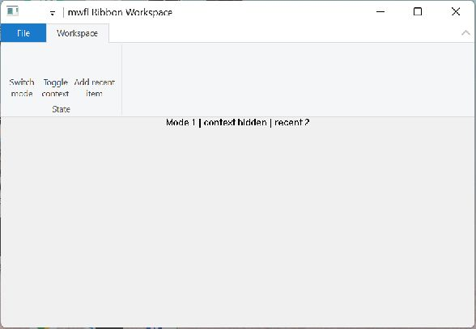

# Ribbon Workspace

This compiled example demonstrates **optional Windows Ribbon command modes contexts recent items settings and structured fallback**. It is intentionally small
enough to study from the source while still using real native Windows controls,
messages, and ownership rules.



## What it demonstrates

- `RibbonCommandModel`
- `RibbonFrameworkHost`
- `RibbonCommandBinding`

The window remains a real HWND and the example preserves mwfl's native escape
hatch. UI objects stay on their creating thread, and no exception is allowed to
cross a Win32 callback.

## Key code

The following excerpt is quoted directly from [`main.cpp`](main.cpp):

```cpp
constexpr mwfl::RibbonCommandId ModeRibbon{1010};
constexpr mwfl::RibbonCommandId ContextRibbon{1020};
constexpr mwfl::RibbonCommandId RecentRibbon{1030};
constexpr mwfl::ControlId ModeCommand{2010};
constexpr mwfl::ControlId ContextCommand{2020};
constexpr mwfl::ControlId RecentCommand{2030};

class RibbonApplication final {
public:
    RibbonApplication(bool self_test, std::optional<std::filesystem::path> result)
        : self_test_(self_test), result_(std::move(result)),
          settings_(HKEY_CURRENT_USER,
              self_test ? L"Software\\mwfl\\Tests\\Ribbon-" +
                              std::to_wstring(::GetCurrentProcessId())
                        : L"Software\\mwfl\\Examples\\RibbonWorkspace", 1) {}

    int Run(HINSTANCE instance, int show) {
        const HRESULT initialized = ::CoInitializeEx(nullptr, COINIT_APARTMENTTHREADED);
```

Read the complete implementation in [`main.cpp`](main.cpp).

## Build and run

From a Visual Studio developer PowerShell at the repository root:

```powershell
cmake --preset vs2026-x64-optional
cmake --build --preset vs2026-x64-optional-debug --target mwfl_ribbon_workspace
build\presets\vs2026-x64-optional\examples\ribbon_workspace\Debug\mwfl_ribbon_workspace.exe
```

Visual Studio 2022 remains supported; substitute the `vs2022-x64` configure and
build presets when validating that toolchain. This example uses the optional `ribbon` component; the optional preset shown above enables its pinned dependency and runtime staging rules.

## Validation

The focused validation targets are `mwfl.ribbon_model`, `mwfl.ribbon_native`, `mwfl.ribbon_workspace_gui`. Run `./scripts/verify-change.ps1 -Execute` after modifying it so
the repository selects the additional checks required by the changed paths.
