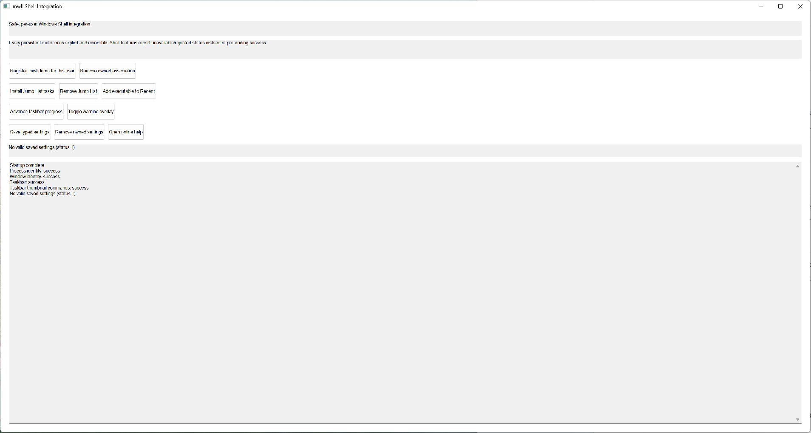

# Shell Integration

This compiled example demonstrates **reversible per-user shell state taskbar thumbnail commands and safe contextual Help with structured fallbacks**. It is intentionally small
enough to study from the source while still using real native Windows controls,
messages, and ownership rules.



## What it demonstrates

- `VersionedSettingsStore`
- `RegisterPerUserFileAssociation`
- `CommitJumpList`
- `TaskbarWindowIntegration`
- `TaskbarThumbnailButton`
- `HelpRequest`
- `LaunchHelp`

The window remains a real HWND and the example preserves mwfl's native escape
hatch. UI objects stay on their creating thread, and no exception is allowed to
cross a Win32 callback.

## Key code

The following excerpt is quoted directly from [`main.cpp`](main.cpp):

```cpp
class ShellIntegrationWindow final : public mwfl::WindowBase {
public:
    void BuildUI() override {
        SetTitle(L"mwfl Shell Integration");
        mwfl::ControlHost ui{*this};
        ui.Add(title_, L"Safe, per-user Windows Shell integration");
        ui.Add(summary_, L"Every persistent mutation is explicit and reversible. Shell features "
                         L"report unavailable/rejected states instead of pretending success.");
        ui.Add(register_, L"Register .mwfldemo for this user");
        ui.Add(remove_, L"Remove owned association");
        ui.Add(jump_list_, L"Install Jump List tasks");
        ui.Add(remove_jump_list_, L"Remove Jump List");
        ui.Add(recent_, L"Add executable to Recent");
        ui.Add(progress_, L"Advance taskbar progress");
        ui.Add(overlay_, L"Toggle warning overlay");
        ui.Add(save_, L"Save typed settings");
        ui.Add(clear_settings_, L"Remove owned settings");
        ui.Add(help_, L"Open online help");
```

Read the complete implementation in [`main.cpp`](main.cpp).

## Build and run

From a Visual Studio developer PowerShell at the repository root:

```powershell
cmake --preset vs2026-x64-optional
cmake --build --preset vs2026-x64-optional-debug --target mwfl_shell_integration_demo
build\presets\vs2026-x64-optional\examples\shell_integration\Debug\mwfl_shell_integration_demo.exe
```

Visual Studio 2022 remains supported; substitute the `vs2022-x64` configure and
build presets when validating that toolchain. This example uses the optional `shell` component; the optional preset shown above enables its pinned dependency and runtime staging rules.

## Validation

The focused validation targets are `mwfl.settings_store`, `mwfl.file_association`, `mwfl.shell_integration`, `mwfl.help`, `mwfl.shell_integration_gui`. Run `./scripts/verify-change.ps1 -Execute` after modifying it so
the repository selects the additional checks required by the changed paths.
