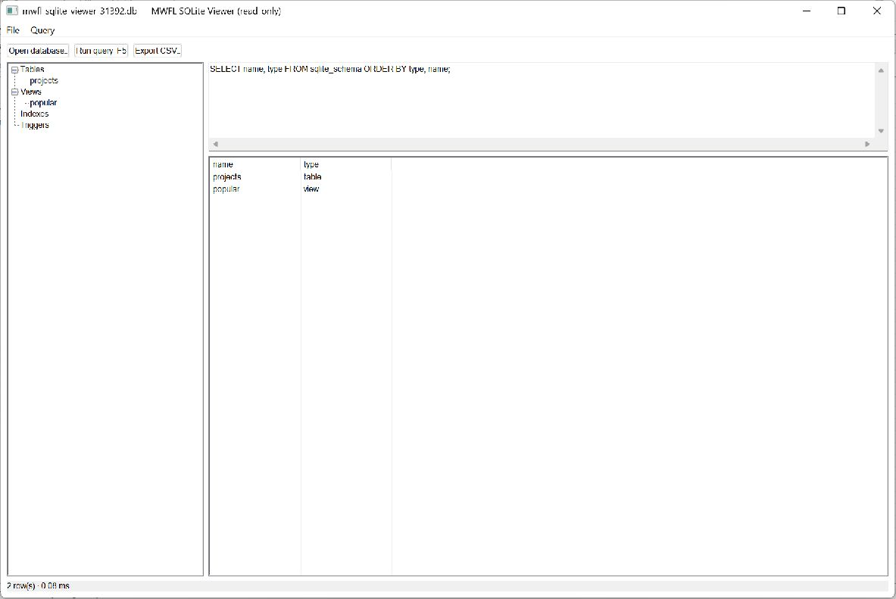

# SQLite Viewer

A native, local-only SQLite workspace built from mwfl controls and the
WinSQLite library included with the Windows SDK. It opens databases read-only,
browses their schema, runs bounded queries, and exports the current result as
CSV.



## Try it

Build the `mwfl_sqlite_viewer` target, then run the executable from the selected
configuration directory. You can open a `.db`, `.db3`, `.sqlite`, or `.sqlite3`
file with the button or `Ctrl+O`, or drop a database onto the window. Press `F5`
to run the query and `Ctrl+Shift+S` to export its visible result.

For a populated, disposable demonstration:

```powershell
build\presets\vs2026-x64\examples\sqlite_viewer\Debug\mwfl_sqlite_viewer.exe --showcase
```

## Key code

The model uses SQLite itself to enforce the safety boundary instead of trying
to recognize SQL with a keyword parser:

```cpp
const std::string utf8_sql = ToUtf8(sql);
sqlite3_stmt* statement = nullptr;
const char* tail = nullptr;
const int prepared = sqlite3_prepare_v2(database_, utf8_sql.c_str(),
                                        static_cast<int>(utf8_sql.size()), &statement, &tail);
if (prepared != SQLITE_OK || statement == nullptr) {
    error = prepared == SQLITE_OK ? L"Enter a SQL query." : ErrorText(database_, prepared);
    return std::nullopt;
}
if (sqlite3_stmt_readonly(statement) == 0) {
    sqlite3_finalize(statement);
    error = L"This viewer only permits read-only SQL statements.";
    return std::nullopt;
}
```

Selecting a table or view produces a safely quoted, bounded query and executes
it immediately:

```cpp
query_.SetText(L"SELECT * FROM " + sqlite_viewer::QuoteIdentifier(object.name) +
               L" LIMIT 500;");
RunQuery();
```

The UI remains ordinary native composition—`TreeView` for schema navigation, a
multiline `TextBox` for SQL, and a report `ListView` for results:

```cpp
mwfl::ControlHost ui{*this};
ui.Add(open_, kOpen, L"Open database…");
ui.Add(run_, kRun, L"Run query  F5");
ui.Add(export_, kExport, L"Export CSV…");
ui.Add(schema_, kSchema);
ui.Add(query_, kQuery,
       L"SELECT name, type FROM sqlite_schema ORDER BY type, name;",
       query_options);
ui.Add(results_, kResults);
```

See [`main.cpp`](main.cpp) for the responsive layout and
[`sqlite_database.cpp`](sqlite_database.cpp) for query/CSV implementation.

## Product boundaries

- One read-only statement is accepted at a time.
- Results stop at 5,000 rows and report truncation and elapsed time.
- `NULL` and BLOB values stay explicit.
- CSV is UTF-8 with BOM and fully quoted fields.
- Failures are shown in the application; no exception crosses a Win32 callback.

The full contract and validation notes are in
[`docs/tutorials/sqlite-viewer.md`](../../docs/tutorials/sqlite-viewer.md).
